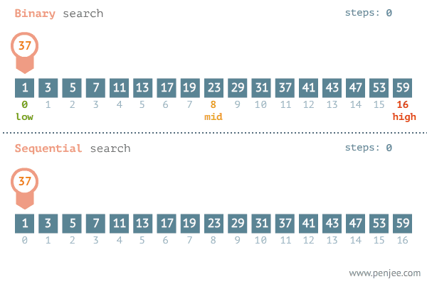

# Recursive Binary Search
Disciplina: Programação 2  
Faculdade: IFSC Florianópolis

## Descrição
Esse projeto contém 2 projetos dentro:  

### Projetos
`binary_search_vector // Pesquisa Binária no Heap`  
`binary_search_vector_linear // Pesquisa linear no Heap`

### Como executar
Para executar eles é ncessário ter o compilador do C configurado no Eclipse, após isso basta seguir o seguinte caminho no Eclipse: File > New > C\C++ Project > C Maneged Build > Configurar as opções (nome do projeto, compilador desejado...) > copiar os arquivos da pasta desejada desse git para esse projeto.

### Funcionamento do Algoritmo
Dado um vetor x de tamanho x com seus valores sendo números inteiros.
#### Busca Linear
Temos a busca linear que irá percorrer dado posição do vetor x, a fim de verificar em qual posição está o valor correspondente a busca, ou se já existe esse valor lá.  

Nesse caso, o algoritmo é iterativo, e sua complexidade é O(n).

#### Busca binária recursiva
Temos que a busca será feita da seguinte maneira: em um vetor[0..n] ordenado, será calculado o meio, será  verificado se o valor corresponte ao valor do meio, caso não corresponta, se o valor for menor ele irá realizar o mesmo procedimento, mas só do início até o meio (metade esquerda), caso o contrário (maior), ele fará do meio para o último elemento do vetor (metade direita).  

Caso a metade direita seja maior ou igual a esquerda e não foi encontrado nenhum valor corresponte ao valor pesquisa, o valor não está contido nos valores do vetor.  

Esse algoritmo é recursivo, e sua complexidade é: O(log n).

### Exemplo

  

